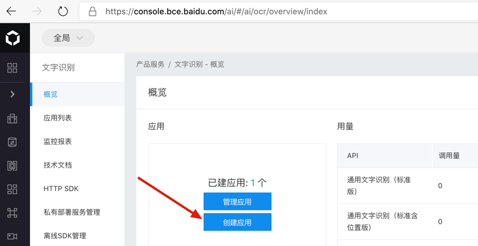
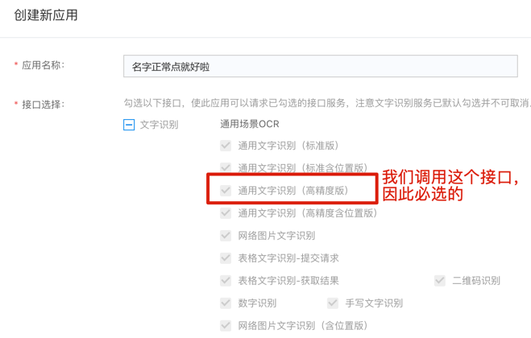
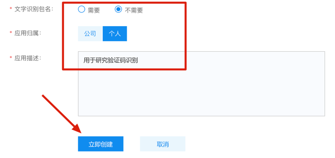
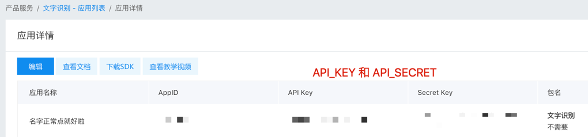
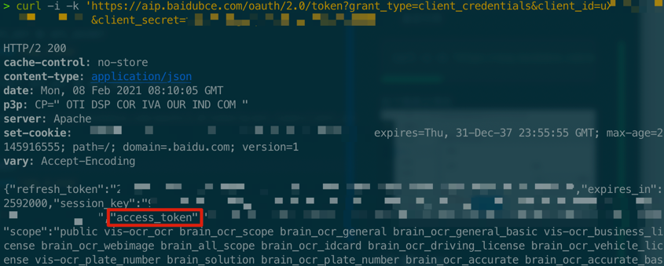
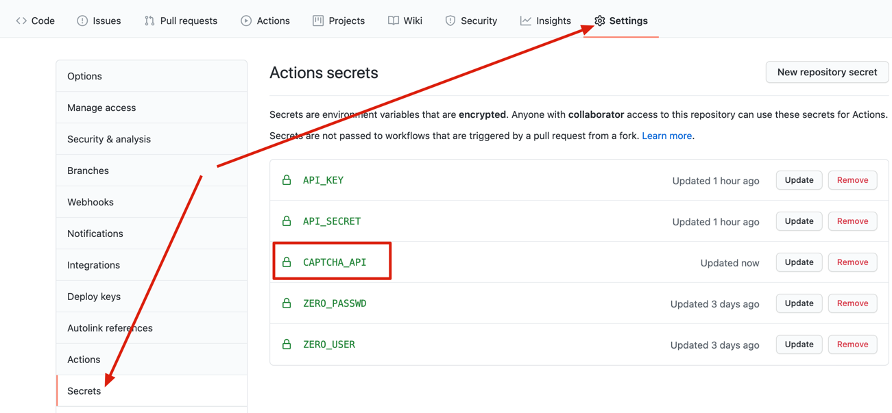

## 免费API
百度API申请链接 https://console.bce.baidu.com/ai/#/ai/ocr/overview/index

1. 创建应用



2. 选择通用文字识别（高精度版）


填写其他信息


填好后点 立即创建即可


3. 获取 API_KEY 和 API_SECRET



4. 可验证下这个 API_KEY 和 API_SECRET 是否可用
```bash
curl -i -k 'https://aip.baidubce.com/oauth/2.0/token?grant_type=client_credentials&client_id=【百度云应用的AK】&client_secret=【百度云应用的SK】'
```

像如下图这样是正常的



## 收费API

注册, 付费一条龙即可
http://www.ttshitu.com/

因为感觉大家比较喜欢白嫖, 因此本项目默认是使用百度API, 如果您喜欢付费的感觉 (验证码识别准确率会高许多, 不过项目本身用百度API也有容错机制, 运行速度会慢点, 问题不是很大), 可以用这个，不过 secret 设置那要加上 `CAPTCHA_API`



值是 `ttshitu_base64_api`