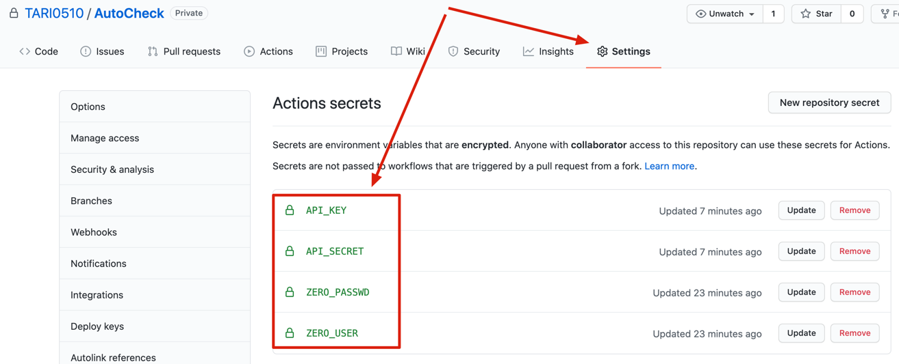
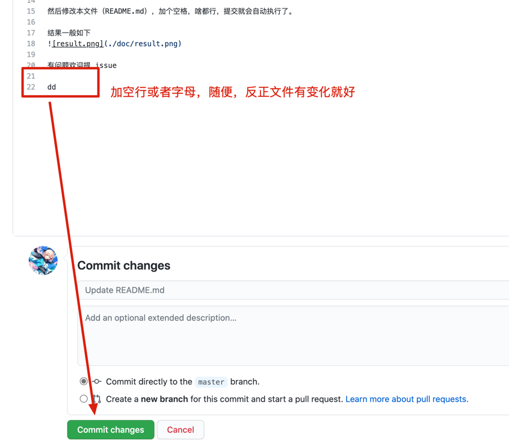
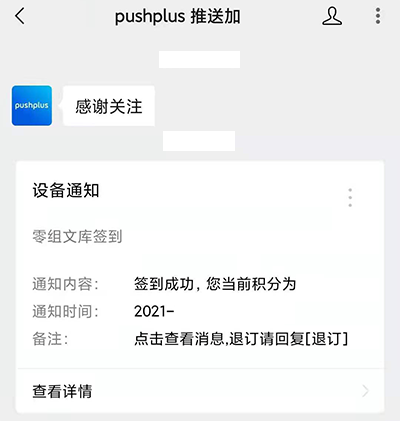

# 零组文库自动签到
通过 Github 自带的 CI/CD 功能实现零组文库自动签到~

本项改了亿点点官方给的脚本（见文末），实现无需服务器即可免费自动签到零组文库
 
本项目食用很简单，就 2 步
## 使用方法

1. 先 Fork 一份到自己仓库，然后在 Settings -> Secrets 添加如下信息:
> 注意: 名字不能乱取，名字不能乱取，放心，这个别人是无法看到的
+ ZERO_USER: 零组的登录帐号
+ ZERO_PASSWD: 零组的登录密码
+ API_KEY: 第三方验证码识别API AK
+ API_SECRET: 第三方验证码识别API SK

API_KEY 和 API_SECRET 获取方法见 [API获取](./API获取.md)

添加完如下图

2. 然后在自己的仓库，给自己点个 star，就会开始啦

记得是自己的仓库, 跑来我这里star是不会触发的...不过我倒是不介意 (

结果一般如下 (2021.7.28 久久没看)

这个脚本是 每天早上6点 自动执行，想要修改可以更改 [.github/workflows/zero-org-check.yml](./.github/workflows/zero-org-check.yml) 文件的 `- cron: '0 22 * * *`
 部分

### pushplus 微信公众号推送 (可选)
感谢 [@ht0Ruial](https://github.com/ht0Ruial) PR

同样需要在 Settings -> Secrets 添加
+ PLUSPUSH: pluspush推送服务的token

使用 [pushplus](https://www.pushplus.plus/) 平台进行推送, token获取方法：
1. 访问 [pushplus](https://www.pushplus.plus/) 官网，登录
2. 找到**一对一推送**，并复制你的**token**

效果大概如下

### 有问题欢迎提 issue

## 已知问题
+ Q1: 百度验证码API隔几天会过期，需要重新申请 (2021.7.28)

这个好像因为百度API平台没有实名验证导致的 (提出这个问题的同学没实名，我实名了一直没过期)

## 鸣谢
+ https://github.com/0-Xyao/Zero-box/tree/main/文库签到脚本
+ 感谢[果果同学](https:///github.com/imguoguo)提供的star触发action方式建议，一直在想怎样才能简单点
